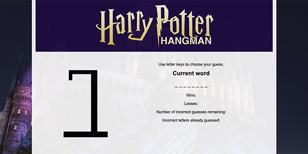

## Harry Potter Hangman Game
This game was created using javascript arrays and a filter function to prevent guessing the same letter more than once. If else statements determine whether the user guess is included in the word and update the DOM accordingly. If else statements are also used to determine win or loss.

## Getting started
This simple game requires no installations to run. Simply clone the repo and open the index.html file in a browser.

## Technology used
* HTML5/CSS3
* JavaScript
* Bootstrap CSS

## Playing the game
* Game starts when you press any letter key to make your first guess.
* Correct letter guesses will replace the blanks in the word.
* Incorrect guesses will display under "Incorrect letters already guessed." 
* If you complete all the blanks in the word before the man hangs you win.
* If you get 6 incorrect guesses you lose.
* Click "Play Again" to reset the game.

